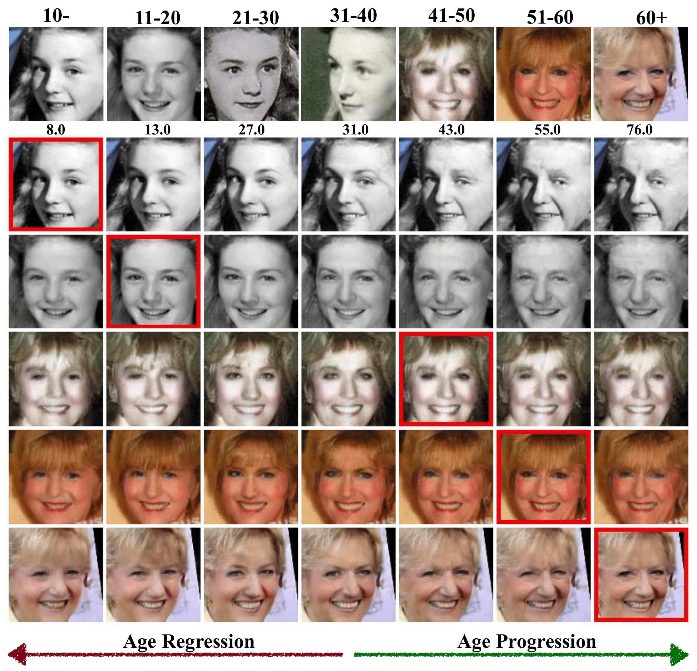
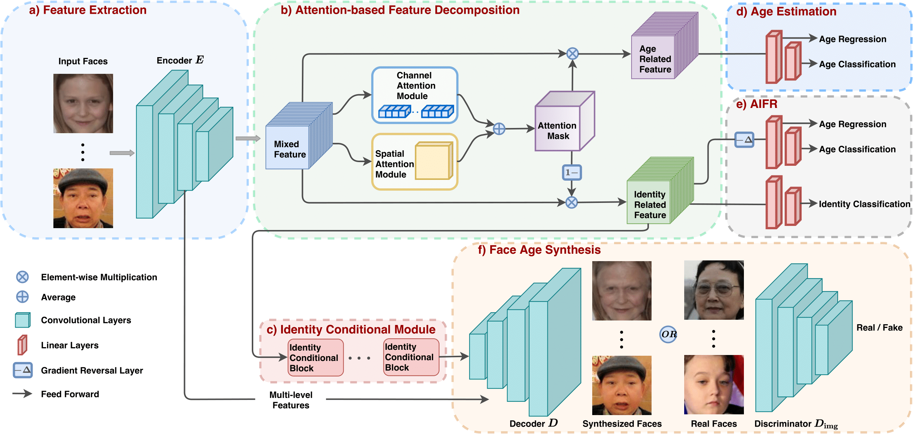

### MTLFace
This repository contains the PyTorch implementation and the dataset of the paper: **When Age-Invariant Face Recognition Meets Face Age Synthesis: A Multi-Task Learning Framework (CVPR 2021 oral)**

> When Age-Invariant Face Recognition Meets Face Age Synthesis: A Multi-Task Learning Framework <br>
> https://arxiv.org/abs/2103.01520<br>
> Abstract: To minimize the effects of age variation in face recognition, previous work either extracts identity-related discriminative features by minimizing the correlation between identity- and age-related features, called age-invariant face recognition (AIFR), or removes age variation by transforming the faces of different age groups into the same age group, called face age synthesis (FAS); however, the former lacks visual results for model interpretation while the latter suffers from artifacts compromising downstream recognition. Therefore, this paper proposes a unified, multi-task framework to jointly handle these two tasks, termed MTLFace, which can learn age-invariant identity-related representation while achieving pleasing face synthesis. Specifically, we first decompose the mixed face features into two uncorrelated components---identity- and age-related features---through an attention mechanism, and then decorrelate these two components using multi-task training and continuous domain adaption. In contrast to the conventional one-hot encoding that achieves group-level FAS, we propose a novel identity conditional module to achieve identity-level FAS, with a weight-sharing strategy to improve the age smoothness of synthesized faces. In addition, we collect and release a large cross-age face dataset with age and gender annotations to advance AIFR and FAS. Extensive experiments on five benchmark cross-age datasets demonstrate the superior performance of our proposed MTLFace over state-of-the-art methods for AIFR and FAS. We further validate MTLFace on two popular general face recognition datasets, showing competitive performance for face recognition in the wild.


------


#### DATASET

1. Downloading MS1M-ArcFace, CASIA-Webface or test set from [insightface](https://github.com/deepinsight/insightface/wiki/Dataset-Zoo).
2. Extract the jpg images from the mxnet .rec or .bin file according to the comments in the source code like:
```
python convert_insightface.py --source /home/zzhuang/faces_webface_112x112 --dest /home/zzhuang/casia-webface-112x112-arcface
python convert_insightface.py --bin --source /home/zzhuang/faces_webface_112x112/agedb_30.bin --dest /home/zzhuang/arcface-test-set
```
3. Downloading the annotations from [Dropbox](https://www.dropbox.com/sh/fj848yjz9602nhb/AADgCTUkVOgAv4uRyn5GwdiJa?dl=0), which is organized by `id filename age gender`; 1 for male and 0 for female.

4. Putting the dataset and annotations into the dataset folder.

#### REQUIREMENTS

see `requirements.txt` and run `pip install -r requirements.txt`.

#### TRAINING

train AIFR:
```
python -m torch.distributed.launch --nproc_per_node=8 --master_port=17647 main.py \
    --train_fr --backbone_name ir50 --head_s 64 --head_m 0.35 \
    --weight_decay 5e-4 --momentum 0.9 --fr_age_loss_weight 0.001 --fr_da_loss_weight 0.002 --age_group 7 \
    --gamma 0.1 --milestone 20000 23000 --warmup 1000 --learning_rate 0.1 \
    --dataset_name scaf --image_size 112 --num_iter 36000 --batch_size 64 --amp
```

train FAS:
```
python -m torch.distributed.launch --nproc_per_node=8 --master_port=17647 main.py \
    --train_fas --backbone_name ir50 --age_group 7 \
    --dataset_name scaf --image_size 112 --num_iter 36000 --batch_size 64 \
    --d_lr 1e-4 --g_lr 1e-4 --fas_gan_loss_weight 75 --fas_age_loss_weight 10 --fas_id_loss_weight 0.002
```
If you want to train both tasks, please use apex.

#### Citation

If you found this code or our work useful please cite us:

```
@article{huang2020mtlface,
  title={When Age-Invariant Face Recognition Meets Face Age Synthesis: A Multi-Task Learning Framework},
  author={Huang, Zhizhong and Zhang, Junping and Shan, Hongming},
  journal={CVPR},
  year={2021},
}
```

#### Acknowledgement

As my first CVPR paper, here I would appreciate all my co-authors and four anonymous reviewers for their valuable time, especially the one of them for his or her strong approvement to my work.
